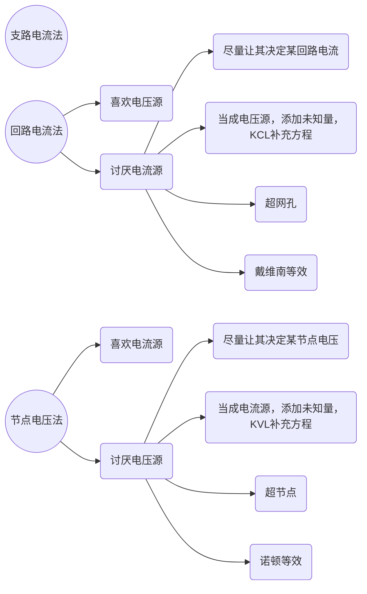

```mermaid
graph LR;
    1((支路电流法));
    2((回路电流法));
    3((节点电压法));
    21(喜欢电压源);
    22(讨厌电流源);
    31(喜欢电流源);
    32(讨厌电压源);
    221(尽量让其决定某回路电流);
    321(尽量让其决定某节点电压);
    222("当成电压源，添加未知量，KCL补充方程");
    322("当成电流源，添加未知量，KVL补充方程");
    223(超网孔);
    323(超节点);
    224(戴维南等效);
    324(诺顿等效);
    
    2-->21; 
    2-->22;
    22-->221;
    22-->222;
    22-->223;
    22-->224;
    3-->31; 
    3-->32;
    32-->321;
    32-->322;
    32-->323;
    32-->324;
```

