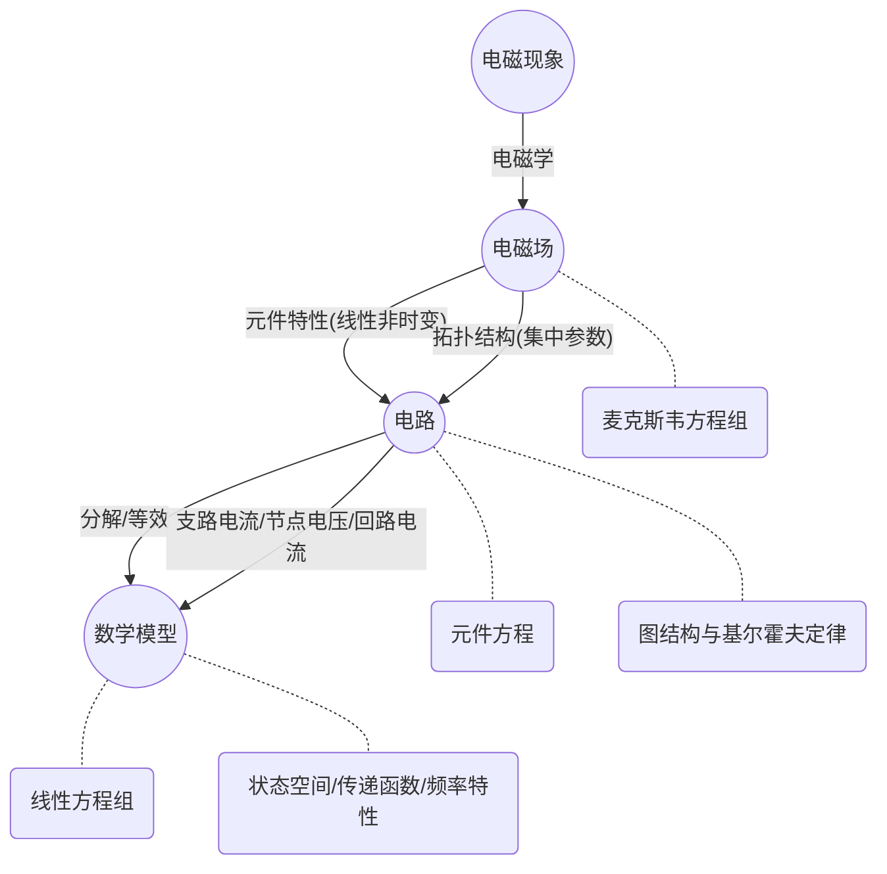

```mermaid
graph TD;
    0((电磁现象));
    1((电磁场));
    2((电路));
    3((数学模型));
    10(麦克斯韦方程组);
    20(元件方程);
    21(图结构与基尔霍夫定律);
    30(线性方程组);
    31(状态空间/传递函数/频率特性);
    0--电磁学-->1-.-10;
    1--"元件特性(线性非时变)"-->2;
    1--"拓扑结构(集中参数)"-->2;
    2-.-20; 2-.-21;
    2--"分解/等效"-->3;
    2--"支路电流/节点电压/回路电流"-->3;
    3-.-30; 3-.-31;
```

